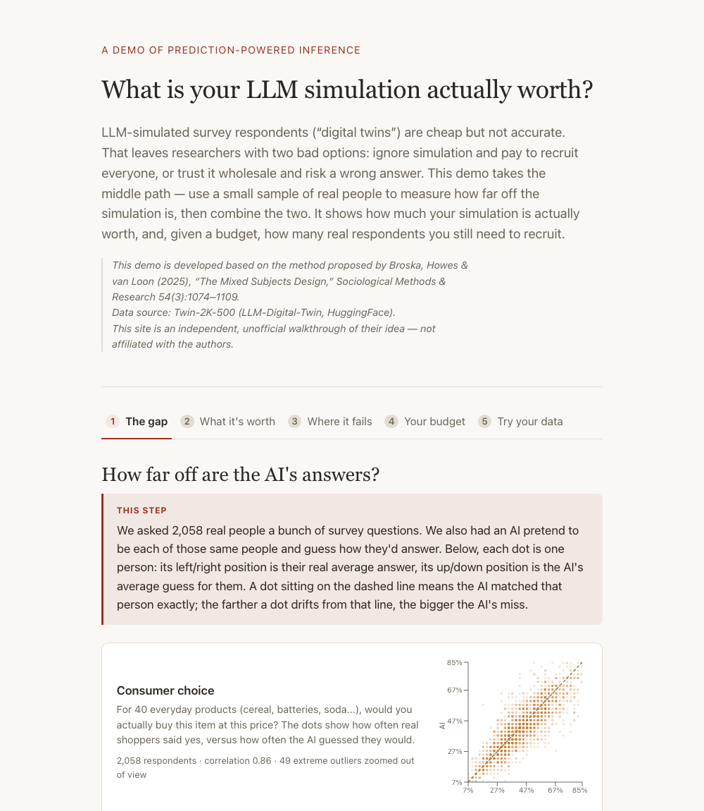

# What is your LLM simulation actually worth?

An interactive demo of prediction-powered inference (PPI): it measures how far
an LLM-simulated "digital twin" survey diverges from real respondents, then
shows how many real interviews that simulation is actually worth — and, given
a budget, how to split it between real and simulated respondents.



## Try it

```bash
git clone <this-repo-url>
cd simulation-worth
npm install
npm run dev
```

Open the printed `localhost` URL. That's it — `src/data/twin2k.json` is
already committed, so no data setup is needed to run the site.

## What's here

A single Vite + React page with five tabs, each answering one question in
plain language before showing any formula:

1. **The gap** — real vs. simulated answers, plotted per respondent, for six
   topic domains (consumer choice, risk framing, probability judgment,
   anchoring, consistency/value judgments, self-referential bias).
2. **What it's worth** — the effective sample size: how many real interviews
   the AI-simulated respondents are equivalent to.
3. **Where it fails** — that same number broken down by domain, so you can
   see which topics the simulation can be trusted on and which it can't.
4. **Your budget** — a calculator: given costs and a budget (or a target
   precision), what's the optimal split between real and simulated
   respondents, and what does it save over a humans-only survey.
5. **Try your data** — paste or upload your own `human,simulated[,group]` CSV
   and tabs 2–4 recompute against it instead of the demo dataset.

Every formula is behind a collapsible "Show the math" block, typeset with
KaTeX, next to the plain-language explanation.

## Project structure

```
data/prepare.py        Downloads the raw dataset and writes src/data/twin2k.json
src/lib/ppi.js          Pure functions for the PPI math (unit tested)
src/lib/csv.js           CSV parsing/validation for the "try your data" tab
src/lib/customDataset.js Turns parsed CSV rows into the same shape as twin2k.json
src/components/          The five tabs and their charts
```

Run the unit tests with:

```bash
npm test
```

## Regenerating the data

The committed `src/data/twin2k.json` was built by `data/prepare.py` from the
[Twin-2K-500](https://huggingface.co/datasets/LLM-Digital-Twin/Twin-2K-500)
dataset (no HuggingFace account or token needed — it's public). To regenerate
it yourself:

```bash
pip install pandas numpy requests huggingface_hub pyarrow
python data/prepare.py
```

This downloads the raw CSVs into `data/raw/` (gitignored — raw data is never
committed) and writes the computed per-domain statistics to
`src/data/twin2k.json`. The script's module docstring documents exactly which
files it uses, the per-item scoring rule, and which items it excludes and why.

## Deploying

Zero-config on [Vercel](https://vercel.com): it's a static Vite build with no
server-side routing, so the default `npm run build` / `dist` output works
as-is (see `vercel.json`). To deploy your own copy:

```bash
npx vercel
```

## The method

This demo implements the effective-sample-size framework from Broska, Howes &
van Loon (2025), "The Mixed Subjects Design," *Sociological Methods &
Research* 54(3):1074–1109 — prediction-powered inference (PPI) applied to
combining a small human-labeled sample with a large LLM-simulated one. The
core identities:

```
theta_hat_PPI = mean(f over N simulated) + mean(Y - f over n labeled)
Var(theta_hat_PPI) = var(f)/N + var(Y-f)/n
n_eff = var(Y) / Var(theta_hat_PPI)
```

This is an independent, unofficial walkthrough of their idea built to explain
it with a real dataset — not affiliated with the authors.

## Assumptions and limits

- Treats the human sample as a valid gold standard. If the humans were
  themselves biased or unrepresentative, PPI corrects toward them, not toward
  some deeper truth.
- Assumes the calibration sample (the humans compared against the simulation)
  is drawn from the same population as whoever you actually care about. If
  your target population differs, the correction can fail silently.
- The correlation figures shown are plain Pearson correlation between human
  and simulated scores — not the "PPI correlation" Broska et al. define in
  the paper. That definition wasn't accessible while building this demo.
- Effective sample size and the budget calculator assume the bias and
  variance measured here will hold for new, not-yet-collected respondents
  from the same population — not guaranteed for a different LLM, prompt, or
  population.
- The Twin-2K-500 dataset's paired human/simulated data only covers a
  behavioral-economics/heuristics-and-biases battery — there's no paired
  personality or moral-judgment data, so this demo doesn't claim to cover
  those (see `data/prepare.py`'s docstring for the full data reconnaissance).
